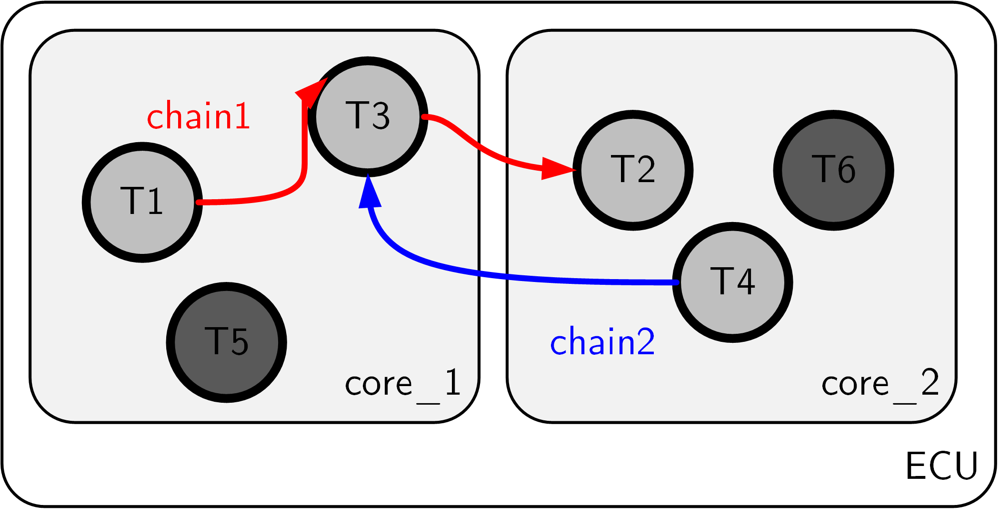
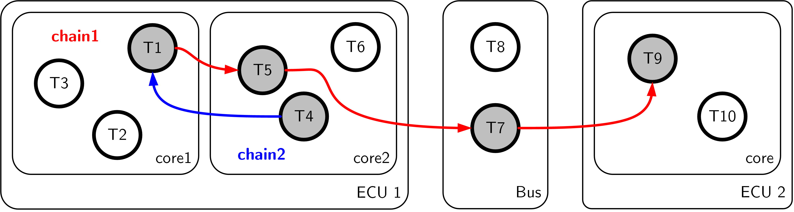
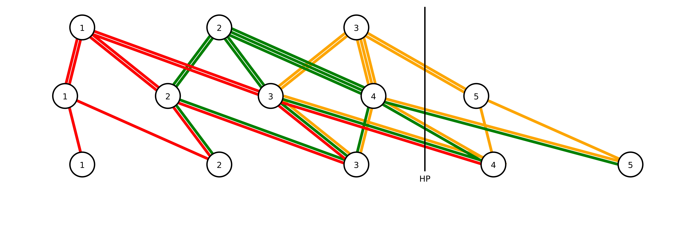
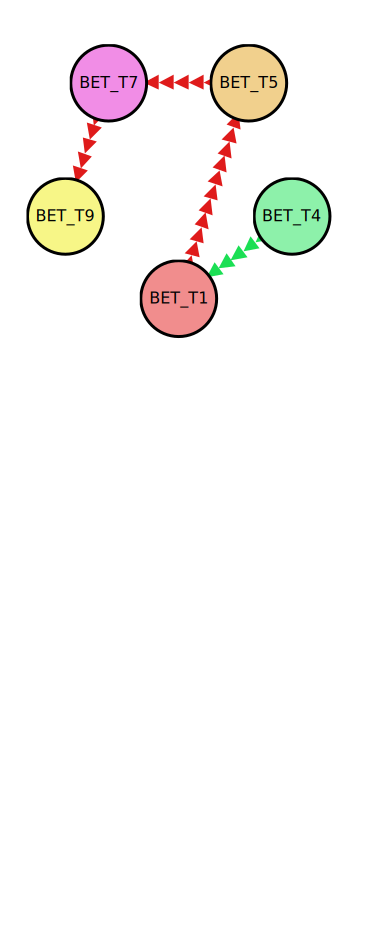

Quickstart
================================
This section gives an overview how to use the tool TORO.

Installation
------------
This section explains how to install the tool TORO. 

* Install a Python Interpreter (version 3). 
  You may want to install a distribution, e.g., Python(x,y), which already 
  contains many useful packages.

* The tool TORO will be delivered in a folder ``toro_project``. 
  This folder has the following content: 
  * **Main script** ``toro_main.py``
  * The libraries **pycpa** and  **toro** in the folder ``./libs``. The libraries under ``./libs`` are dynamically included and do not need to be installed unless you want to change their location. 
  * **Input folder** ``data``. Systems to be analyzed can be stored here. 
	
* Save the folder ``toro_project`` to your preferred destination.

Use
---
* Open a terminal and change to the ``/toro_project`` folder.
* The tool TORO is called via the script ``toro_main.py``. 
 

Command Line Switches
^^^^^^^^^^^^^^^^^^^^^^
* ``--path``: 
  A path is passed to the script as an argument to specify the location of 
  the systems to be analyzed. 
  It is recommended to store the system in the provided ``data`` folder. 
  If several systems are to be analyzed, a subfolder can be created in ``data`` 
  for each system to be analyzed. the folder structure is illustrated below.
  
  .. figure:: ../figures/folder_structure.jpg
    :width: 400px
    :align: center
    :alt: alternate text
    :figclass: align-center
  
  
* ``--wcrt``: 
  This options causes that *only* WCRTs for tasks are computed and written to
  a csv-file ``wcrt_results.csv`` in the respective system folder. 
  
*  \ ``--lat``:
   This option causes that *only* WCRTs and maximum end-to-end latencies are computed.
   WCRTs are written in ``wcrt_results.csv`` and latencies to ``lat_results.csv`` in
   the respective system folder.
   
*  \ ``--test``: This option activates a validity test for computed robustness margins for debug purposes.   

* An exemplary call of the tool would then look as follows:
  ::
  
	user@computer:~/toro_project$ python toro_main.py --path ./data 
	

Input Files
------------
This section explains how to specify systems that the tool TORO should analyze.
Firstly, TORO calls the method ``get_system_dirs(dir)`` and searches in the specified
path for systems to be analyzed. Each individual system should be encapsulated
in a dedicated folder as illustrated in the above figure. This system folder should contain three semicolon-separated 
csv-files, namely

* chains.csv,
* resources.csv,
* tasks.csv.

These files can be created in Microsoft Excel, for example, and can then be exported as CSV files.
If TORO finds more than one system in the specified top-level folder (e.g. ``.\data``), 
the user can choose from a list which system(s) should be examined. 
An example output would look like this:

.. code-block:: none

	The following systems have been found:
	1: system1
	2: system2
	3: system3
	0: all
	
	To select systems enter their ID or a comma-separated list of IDs. 
	For instance, enter 1 to select the first of the listed systems, 
	enter 1,3 to select the first and the third of the listed systems, 
	or enter '0' to select all systems:

The following sections explain the structure of the CSV files and demonstrate the three possible types of use cases  
and which information needs to be filled in.

Input File 'resources.csv'
^^^^^^^^^^^^^^^^^^^^^^^^^^^^
The ``resources.csv`` file describes the execution platform of the system by listing the different resources 
(CPUs, CAN bus etc.) and the scheduling policy that is applied on each resource. 
Currently static priority preemptive and static priority non-preemptive scheduling is supported.
The ``resources.csv`` file should have for each resource the following entries:

* | **[name]** Type: String 
  | Each computing core and each data bus, on which at least one chain task is executed, is represented by a so-called resource. This field specifies the name of the resource.
  
* | **[scheduler]** Type: String  
  | e.g., ``SPPScheduler`` or ``SPNPScheduler``

Input File 'tasks.csv'
^^^^^^^^^^^^^^^^^^^^^^
The ``tasks.csv`` file specifies tasks that are executed on the platform, it should have for each task the following entries:

* | **[task_name]** Type: String   
  | Unique task ID
  
* | **[period]** Type: Integer   
  | Activation period	
			
* | **[offset]** Type: Integer   
  | Release offset
		
* | **[priority]** Type: Integer   
  | Note that 0 is the highest priority.
		
* | **[wcet]** Type: Integer   
  | Worst Case Execution Time		
		
* | **[resource]** Type: String   
  | Resource that services the task. 
    The name should match a resource from file ``resources.csv``.
		
* | **[bcrt]** Type: Integer   
  | Best Case Response Time		
		
* | **[wcrt]** Type: Integer   
  | Worst Case Response Time
		
* | **[let]** Typ: Integer   
  | Logical Execution Time 

Input File 'chains.csv'
^^^^^^^^^^^^^^^^^^^^^^^^
The ``chains.csv`` file specifies which tasks are part of each cause-effect chain; 
it should have for each chain the following entries:

* | **[chain_name]** Type: String  
  | Unique cause-effect chain ID

* | **[e2e\_deadline]** Type: Integer 
  | End-to-end deadline 	
  	
* | **[members]** Type: String 
  | The member tasks must be listed in correct order and the task names must match those in the task definitions. The list of member tasks comprises as many cells in a row as needed.

Use Cases 
---------

Use Case 1: Cause-effect chains with BET tasks, WCRT for each chain task known
^^^^^^^^^^^^^^^^^^^^^^^^^^^^^^^^^^^^^^^^^^^^^^^^^^^^^^^^^^^^^^^^^^^^^^^^^^^^^^^^

.. note::
   * applicable to many systems
   * the name, period, offset, WCRT of every task in a cause-effect chain must be known

Use Case 1 requires that

* all clocks in the system are synchronized,
* all tasks in the cause-effect chains are BET tasks,
* task deadlines are implicit,
* all BCRTs and WCRTs of chain tasks are known,

which is checked in an interactive user query.

An example system of type Use Case 1 is depicted in Figure \reffig:use-case-1.
For the example system, the file ``resources.csv`` would contain:

+-------------+---------------+
| **name**    | **scheduler** |
+-------------+---------------+
| unknown     | unknown       |
+-------------+---------------+

With regard to the tasks that are part of the cause-effect chains to be analyzed, we have in ``tasks.csv``: 

.. csv-table::
	:header: "task_name", "period", "offset", "priority", "wcet", "resource", "bcrt", "wcrt", "let"
	  
	"BET_T1", 10, 2, "n/a", "n/a", "unknown", 0,  5, "n/a"
	"BET_T4", 20, 5, "n/a", "n/a", "unknown", 2, 15, "n/a"
	"BET_T5",  5, 0, "n/a", "n/a", "unknown", 1,  3, "n/a"
	"BET_T7", 15, 1, "n/a", "n/a", "unknown", 3, 10, "n/a"
	"BET_T9", 30, 5, "n/a", "n/a", "unknown", 5, 20, "n/a"
	 	

Note that a number of fields in ``resources.csv`` and ``tasks.csv`` can be declared as 'unknown' 
resp. ``'n/a'`` because the WCRTs are already available and do not need to be computed from these parameters.

The cause-effect chains in ``chains.csv`` are specified by

.. csv-table::
	:header: "chain_name", "e2e_deadline", "members", "", "", ""
	  
	"BETchain1", 75, "BET_T1", "BET_T5", "BET_T7", "BET_T9"  
	"BETchain2", 40, "BET_T4", "BET_T1", "", ""  

	
	Use Case 1. Parts of the system, which are relevant for the analysis, are shaded.

Use Case 2: Cause-effect chains with BET tasks, WCRT of each chain task computable
^^^^^^^^^^^^^^^^^^^^^^^^^^^^^^^^^^^^^^^^^^^^^^^^^^^^^^^^^^^^^^^^^^^^^^^^^^^^^^^^^^^^

.. note::
	* only applicable to systems with \acspp und \acspnp scheduling
	* not only tasks that are part of cause-effect chains must be specified but also the entire background load with all parameters

Use Case 2 requires that
* all clocks in the system are synchronized,
* ALL tasks are BET tasks (not only those in the listed cause-effect chains),
* task deadlines are implicit,	
* task offsets are zero,
* ALL tasks in the system must be known with their parameters,
* ALL resources must be known with their scheduling algorithms (SPP or SPNP) and the task-to-resource mapping,
which is checked in an interactive user query.

An example system of type Use Case 2 is depicted in Figure \reffig:use-case-2.
For the example system, the file ``resources.csv`` would contain:

.. csv-table::
	:header: "Name", "Scheduler"
	  
	"core_1", sppscheduler 
	"core_2", spnpscheduler   

With regard to the tasks that are part of the cause-effect chains to be analyzed, we have not only the chain tasks but also the tasks of the background load with all parameters required to compute the WCRTs.

.. csv-table::
	:header: "task_name", "period", "offset", "priority", "wcet", "resource", "bcrt", "wcrt", "let"

	"BET_T1",  5, 0, 1, 1, "core_1", "n/a", "n/a", "n/a"  
	"BET_T3", 15, 0, 3, 3, "core_1", "n/a", "n/a", "n/a"  
	"BET_T5", 10, 0, 2, 2, "core_1", "n/a", "n/a", "n/a"  
	"BET_T2", 10, 0, 2, 1, "core_2", "n/a", "n/a", "n/a"  
	"BET_T4",  5, 0, 1, 1, "core_2", "n/a", "n/a", "n/a"  
	"BET_T6", 20, 0, 3, 4, "core_2", "n/a", n/a", "n/a"  

The cause-effect chains are specified again by

.. csv-table::
	:header: "chain_name", "e2e_deadline", "members", "", ""
	
	"BETchain1", 50, "BET_T1", "BET_T3", "BET_T2"  
	"BETchain2", "n/a", "BET_T1", "BET_T4", "" 

	
	Use Case 2. Parts of the system, which are relevant for the analysis, are shaded.

Use Case 3: Cause-effect chains with LET tasks, LET for each chain task known
^^^^^^^^^^^^^^^^^^^^^^^^^^^^^^^^^^^^^^^^^^^^^^^^^^^^^^^^^^^^^^^^^^^^^^^^^^^^^^^^

.. note::
	 * applicable to LET systems

Use Case 3 requires that

* all clocks in the system are synchronized,
* all tasks in the cause-effect chains are LET tasks,
* all LET tasks have implicit deadlines,	

which is checked in an interactive user query.

An example system of type Use Case 3 is depicted in Figure \reffig:use-case-3.
For the example system, the file ``resources.csv`` would contain:

+-------------+---------------+
| **name**    | **scheduler** |
+-------------+---------------+
| unknown     | unknown       |
+-------------+---------------+

With regard to the tasks that are part of the cause-effect chains to be analyzed, we have in ``tasks.csv``
 
.. csv-table::
	:header: "task_name", "period", "offset", "priority", "wcet", "resource", "bcrt", "wcrt", "let"
	
	"LET_T1", 10, 2, "n/a", "n/a", "unknown", "n/a", "n/a", 5  
	"LET_T4", 20, 5, "n/a", "n/a", "unknown", "n/a", "n/a", 15  
	"LET_T5", 15, 1, "n/a", "n/a", "unknown", "n/a", "n/a", 10  
	"LET_T7",  5, 0, "n/a", "n/a", "unknown", "n/a", "n/a", 3  
	"LET_T9", 10, 1, "n/a", "n/a", "unknown", "n/a", "n/a", 5  		

The cause-effect chains are specified by

.. csv-table::
	:header: "chain_name", "e2e_deadline", "members", " ", " ", " "
		
	"LETchain1", 45,"LET_T1", "LET_T5", "LET_T7","LET_T9"  	
	"LETchain2", 35,"LET_T4", "LET_T1", "",       " "			 

    
    Use Case 3. Parts of the system, which are relevant for the analysis, are shaded.
	
	

Output Files
-------------

Outputs are written into the folder of the specified system.

WCRT Results
^^^^^^^^^^^^^^
The WCRTs of tasks are written to ``wcrt_results.csv`` in the respective system folder. 

Latency Results
^^^^^^^^^^^^^^^^
The WCRTs of tasks are written to ``lat_results.csv`` in the respective system folder. 

Results for Robustness Margins and Delta LETs
^^^^^^^^^^^^^^^^^^^^^^^^^^^^^^^^^^^^^^^^^^^^^^
Results for robustness margins and Delta LETs are written to ``rm_results.csv`` in the respective system folder. 

Log File (*legacy, no longer generated)*)
^^^^^^^^^^^^^^^^^^^^^^^^^^^^^^^^^^^^^^^^^^
The numerical results are written to the text file RESULTS_LOG.txt in the respective system folder. 

Output Diagrams
----------------

Interval Diagram
^^^^^^^^^^^^^^^^^^
In the interval diagram, the individual jobs are represented as numbered circles. 
The blue-marked read intervals represent the earliest possible to latest possible time, when a job can read data. 
The green-marked data intervals bound the period of time in which the output data of a job is available to other jobs.
The short vertical lines stand for the period of a task.
The long vertical lines show the hyper period (HP).

The yellow area covers all instances of the cause-effect chain which are relevant for the computation of 
the maximum end-to-end latency and the robustness margins. 
The dark area highlights one instance of a cause-effect chains which actually has the maximum end-to-end latency. 
The red areas illustrate intervals relevant for the comptutation of the robustness margins.

Reachability Graph
^^^^^^^^^^^^^^^^^^
The reachability graph results from the overlap of read intervals and data intervals of jobs (data flow analysis). 
In the reachability graph, all possible paths of starting in from the first hyperperiod are represented.
These paths are required for the computation of the maximum end-to-end latency and the robustness margins. 
The colored marking of the individual paths makes it easy to recognize where a path begins and ends. The numbers stand for the respective job number. 
    

Data Flow Graph
^^^^^^^^^^^^^^^^
The data flow graph represents the specified cause-effect chains as a tasks with data flow dependencies.

