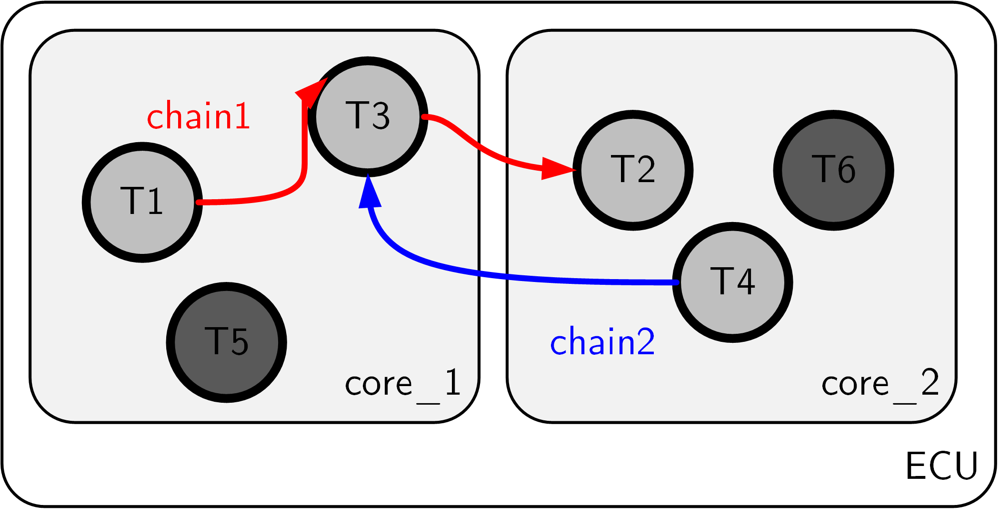
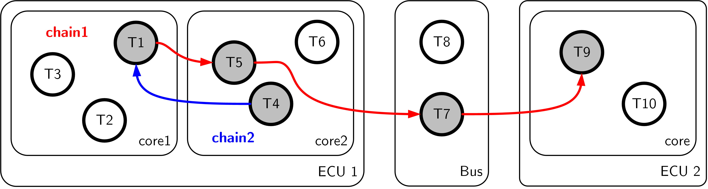

Examples
================================

Use Case 1: Cause-effect chains with BET tasks, WCRT for each chain task known
^^^^^^^^^^^^^^^^^^^^^^^^^^^^^^^^^^^^^^^^^^^^^^^^^^^^^^^^^^^^^^^^^^^^^^^^^^^^^^^^

.. note::
   * applicable to many systems
   * the name, period, offset, WCRT of every task in a cause-effect chain must be known

Use Case 1 requires that:

* all clocks in the system are synchronized,
* all tasks in the cause-effect chains are BET tasks,
* task deadlines are implicit,
* all BCRTs and WCRTs of chain tasks are known

An example system of type Use Case 1 is depicted in Figure \reffig:use-case-1.
For the example system, the file ``resources.csv`` would contain:

+-------------+---------------+
| **name**    | **scheduler** |
+-------------+---------------+
| unknown     | unknown       |
+-------------+---------------+

With regard to the tasks that are part of the cause-effect chains to be analyzed, we have in ``tasks.csv``: 

.. csv-table::
	:header: "task_name", "period", "offset", "priority", "wcet", "resource", "bcrt", "wcrt", "let"
	  
	"BET_T1", 10, 2, "n/a", "n/a", "unknown", 0,  5, "n/a"
	"BET_T4", 20, 5, "n/a", "n/a", "unknown", 2, 15, "n/a"
	"BET_T5",  5, 0, "n/a", "n/a", "unknown", 1,  3, "n/a"
	"BET_T7", 15, 1, "n/a", "n/a", "unknown", 3, 10, "n/a"
	"BET_T9", 30, 5, "n/a", "n/a", "unknown", 5, 20, "n/a"
	 	

Note that a number of fields in ``resources.csv`` and ``tasks.csv`` can be declared as 'unknown' 
resp. ``'n/a'`` because the WCRTs are already available and do not need to be computed from these parameters.

The cause-effect chains in ``chains.csv`` are specified by

.. csv-table::
	:header: "chain_name", "e2e_deadline", "members", "", "", ""
	  
	"BETchain1", 75, "BET_T1", "BET_T5", "BET_T7", "BET_T9"  
	"BETchain2", 40, "BET_T4", "BET_T1", "", ""  

	
	Use Case 1. Parts of the system, which are relevant for the analysis, are shaded.

Use Case 2: Cause-effect chains with BET tasks, WCRT of each chain task computable
^^^^^^^^^^^^^^^^^^^^^^^^^^^^^^^^^^^^^^^^^^^^^^^^^^^^^^^^^^^^^^^^^^^^^^^^^^^^^^^^^^^^

.. note::
	* only applicable to systems with SPP und SPNP scheduling
	* not only tasks that are part of cause-effect chains must be specified but also the entire background load with all parameters

Use Case 2 requires that:

* all clocks in the system are synchronized,
* all tasks' WCRTs are computable (also implies LET tasks, which are not part of the CEC)
* task deadlines are implicit
* all tasks in the system must be known with their parameters,
* all resources must be known with their scheduling algorithms (SPP or SPNP) and the task-to-resource mapping

An example system of type Use Case 2 is depicted in Figure \reffig:use-case-2.
For the example system, the file ``resources.csv`` would contain:

.. csv-table::
	:header: "Name", "Scheduler"
	  
	"core_1", sppscheduler 
	"core_2", spnpscheduler   

With regard to the tasks that are part of the cause-effect chains to be analyzed, we have not only the chain tasks but also the tasks of the background load with all parameters required to compute the WCRTs.

.. csv-table::
	:header: "task_name", "period", "offset", "priority", "wcet", "resource", "bcrt", "wcrt", "let"

	"BET_T1",  5, 0, 1, 1, "core_1", "n/a", "n/a", "n/a"  
	"BET_T3", 15, 0, 3, 3, "core_1", "n/a", "n/a", "n/a"  
	"BET_T5", 10, 0, 2, 2, "core_1", "n/a", "n/a", "n/a"  
	"BET_T2", 10, 0, 2, 1, "core_2", "n/a", "n/a", "n/a"  
	"BET_T4",  5, 0, 1, 1, "core_2", "n/a", "n/a", "n/a"  
	"BET_T6", 20, 0, 3, 4, "core_2", "n/a", n/a", "n/a"  

The cause-effect chains are specified again by

.. csv-table::
	:header: "chain_name", "e2e_deadline", "members", "", ""
	
	"BETchain1", 50, "BET_T1", "BET_T3", "BET_T2"  
	"BETchain2", "n/a", "BET_T1", "BET_T4", "" 

	
	Use Case 2. Parts of the system, which are relevant for the analysis, are shaded.

Use Case 3: Cause-effect chains with LET tasks, LET for each chain task known
^^^^^^^^^^^^^^^^^^^^^^^^^^^^^^^^^^^^^^^^^^^^^^^^^^^^^^^^^^^^^^^^^^^^^^^^^^^^^^^^

.. note::
	 * applicable to LET systems

Use Case 3 requires that:

* all clocks in the system are synchronized,
* all tasks in the cause-effect chains are LET tasks,
* all LET tasks have implicit deadlines

An example system of type Use Case 3 is depicted in Figure \reffig:use-case-3.
For the example system, the file ``resources.csv`` would contain:

+-------------+---------------+
| **name**    | **scheduler** |
+-------------+---------------+
| unknown     | unknown       |
+-------------+---------------+

With regard to the tasks that are part of the cause-effect chains to be analyzed, we have in ``tasks.csv``
 
.. csv-table::
	:header: "task_name", "period", "offset", "priority", "wcet", "resource", "bcrt", "wcrt", "let"
	
	"LET_T1", 10, 2, "n/a", "n/a", "unknown", "n/a", "n/a", 5  
	"LET_T4", 20, 5, "n/a", "n/a", "unknown", "n/a", "n/a", 15  
	"LET_T5", 15, 1, "n/a", "n/a", "unknown", "n/a", "n/a", 10  
	"LET_T7",  5, 0, "n/a", "n/a", "unknown", "n/a", "n/a", 3  
	"LET_T9", 10, 1, "n/a", "n/a", "unknown", "n/a", "n/a", 5  		

The cause-effect chains are specified by

.. csv-table::
	:header: "chain_name", "e2e_deadline", "members", " ", " ", " "
		
	"LETchain1", 45,"LET_T1", "LET_T5", "LET_T7","LET_T9"  	
	"LETchain2", 35,"LET_T4", "LET_T1", "",       " "			 

    
    Use Case 3. Parts of the system, which are relevant for the analysis, are shaded.

Use Case 4-7:  Heterogeneous cause-effect chains, comprised of LET and BET chains
^^^^^^^^^^^^^^^^^^^^^^^^^^^^^^^^^^^^^^^^^^^^^^^^^^^^^^^^^^^^^^^^^^^^^^^^^^^^^^^^^
.. note::
   * examples with a maximum of 3 subchains per CEC

The Use Cases require that:

* all clocks in the system are synchronized
* or all tasks are executed on an arbitrary set of perfectly synchronized resources
* all tasks' WCRTs or LETs are defined

Task descriptions, used for all three use cases can be found in ``tasks.csv``: 

.. csv-table::
	:header: "task_name", "period", "offset", "priority", "wcet", "resource", "bcrt", "wcrt", "let"
	
	"BET_T1", 10, 2, "n/a", "n/a", "unknown", 0,  5, "n/a"
	"BET_T4", 20, 5, "n/a", "n/a", "unknown", 2, 15, "n/a"
	"BET_T5",  5, 0, "n/a", "n/a", "unknown", 1,  3, "n/a"
	"BET_T7", 15, 1, "n/a", "n/a", "unknown", 3, 10, "n/a"
	"BET_T9", 30, 5, "n/a", "n/a", "unknown", 5, 20, "n/a"
	"LET_T1", 10, 2, "n/a", "n/a", "unknown", "n/a", "n/a", 5  
	"LET_T4", 20, 5, "n/a", "n/a", "unknown", "n/a", "n/a", 15  
	"LET_T5", 15, 1, "n/a", "n/a", "unknown", "n/a", "n/a", 10  
	"LET_T7",  5, 0, "n/a", "n/a", "unknown", "n/a", "n/a", 3  
	"LET_T9", 10, 1, "n/a", "n/a", "unknown", "n/a", "n/a", 5  

**Use case 4** is contains a "simple" BET chain and a heterogeneous CEC that is comprised of a BET subchain followed by a LET subchain:

.. csv-table::
	:header: "chain_name", "e2e_deadline", "members", " ", " ", " ", " ", " "
		
	"Mixedchain1", 137,"BET_T4","BET_T1","LET_T1","LET_T5","LET_T7","LET_T9"  	
	"BETchain1", 75,"BET_T1","BET_T5","BET_T7","BET_T9"

**Use case 5** is contains a "simple" LET chain and a heterogeneous CEC that is comprised of a LET subchain followed by a BET subchain:

.. csv-table::
	:header: "chain_name", "e2e_deadline", "members", " ", " ", " ", " ", " "
		
	"Mixedchain1", 150,"LET_T1","LET_T5","LET_T7","LET_T9","BET_T4","BET_T1"  	
	"LETchain2", 55,"LET_T1","LET_T5","LET_T7","LET_T9"

**Use case 6** adds an additional BET subchain to Mixedchain1 from use case 5. Hence MixedChain1 has three subchains:

.. csv-table::
	:header: "chain_name", "e2e_deadline", "members", " ", " ", " ", " ", " ", " ", " "
		
	"Mixedchain1", 170,"LET_T1","LET_T5","LET_T7","LET_T9","BET_T4","BET_T1","LET_T7","LET_T1" 	
	"LETchain2", 55,"LET_T1","LET_T5","LET_T7","LET_T9"

**Use case 7** also contains two subchains: A homogeneous BET chain and a heterogeneous CEC using BET, LET and BET semantics (in that order):

.. csv-table::
	:header: "chain_name", "e2e_deadline", "members", " ", " ", " ", " ", " ", " ", " "
		
	"Mixedchain1", 215,"BET_T1", "BET_T5", "BET_T7", "BET_T9","LET_T1","LET_T4","BET_T4","BET_T1" 	
	"BETchain1", 75, "BET_T1", "BET_T5", "BET_T7", "BET_T9"

Note that Mixedchain1 is a loop. Typically such loops are not allowed!  Having adopted the use case from the extended previous TORO version the use case was kept. For showcasing the decomposition of CECs the chains is still useable.
However, using the deadline definition of 215 ms, the tool cannot determine a precise subchain deadline as one of the preliminary deadline calculated first already violates the condition: subchain latency <= subchain deadline.

Use Case 8: System Level Logical Execution Time 
^^^^^^^^^^^^^^^^^^^^^^^^^^^^^^^^^^^^^^^^^^^^^^^^^^^^^^^^^^^^^^^^^^^^^^^^^^^^^^^^
.. note::
   * The example contains a LET interconnect task, added due to the introduction of SL LET

The use case takes the system from use case 3, replacing the message task **T7** transmitted via the bus with a LET interconnect task TIC7. ECU1 and ECU2 are assumed to be not perfectly synchronized but rather the synhronization error between the two resources is bound from above with 1 ms. The worst case transmission time (WCRT) is increased to 5 ms. Adhering to the LET definition (LET >= WCRT + sync_error) for interconnect tasks, the LET is defined as 7 ms. As a result the LET exceeds the 

.. csv-table::
	:header: "task_name", "period", "offset", "priority", "wcet", "resource", "bcrt", "wcrt", "let"
	
	"LET_T1", 10, 2, "n/a", "n/a", "unknown", "n/a", "n/a", 5  
	"LET_T4", 20, 5, "n/a", "n/a", "unknown", "n/a", "n/a", 15  
	"LET_T5", 15, 1, "n/a", "n/a", "unknown", "n/a", "n/a", 10  
	"LET_TIC7",  5, 0, "n/a", "n/a", "unknown", "n/a", "n/a", 7  
	"LET_T9", 10, 1, "n/a", "n/a", "unknown", "n/a", "n/a", 5

The deadline of chain LETchain1 has been increased to 60 ms.

.. csv-table::
	:header: "chain_name", "e2e_deadline", "members", " ", " ", " "
		
	"LETchain1", 60,"LET_T1", "LET_T5", "LET_TIC7","LET_T9"  	
	"LETchain2", 35,"LET_T4", "LET_T1"

